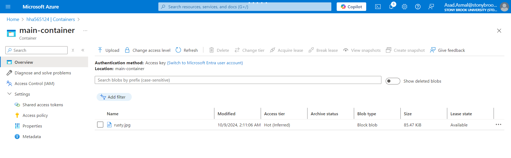
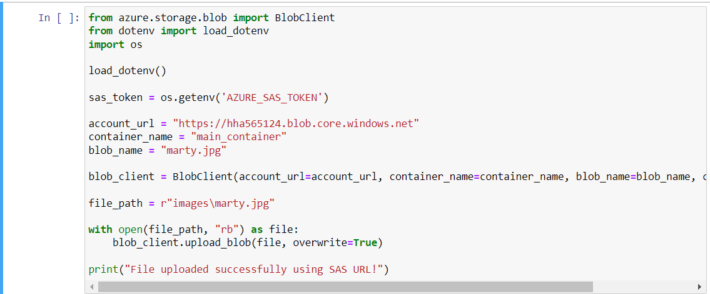
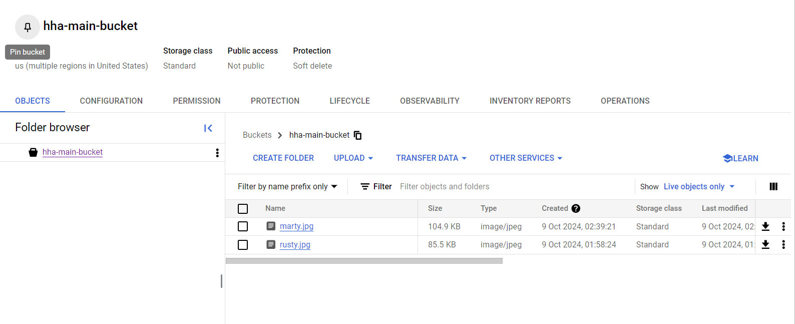
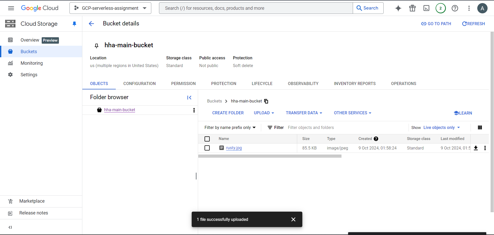
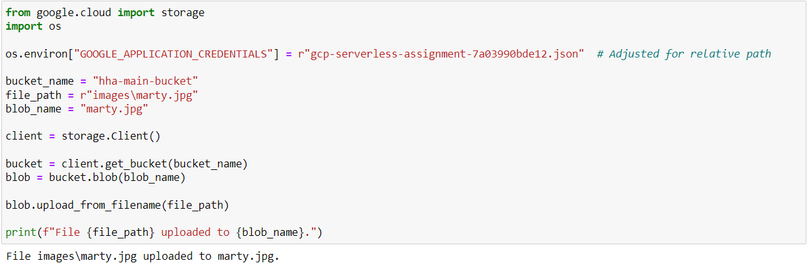
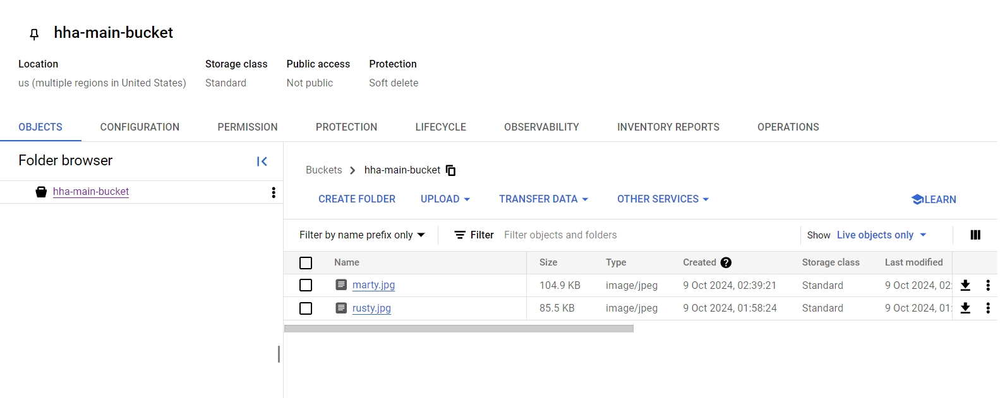

# Cloud Storage Assignment: Azure & GCP

## Part 1: File Uploads via GUI

### Azure Blob Storage:
Uploading image via upload button:


Uploading image via python code:




### GCP Cloud Storage:
Uploading image via upload button:


Uploading image via python code:



## Part 2: File Uploads via Python

### Azure Blob Storage:
```python
# This is a Python code block for Azure Blob Storage
from azure.storage.blob import BlobClient

account_url = "https://hha565124.blob.core.windows.net"
container_name = "main_container"
blob_name = "marty.jpg"


blob_client = BlobClient(account_url=account_url, container_name=container_name, blob_name=blob_name, credential=sas_token)

file_path = r"images\marty.jpg"  

with open(file_path, "rb") as file:
    blob_client.upload_blob(file, overwrite=True)

print("File uploaded successfully using SAS URL!")
```

  
### GCP Cloud Storage:

    # This is python code block for GCP Cloud Storage
    from google.cloud import storage
    import os
    
    os.environ["GOOGLE_APPLICATION_CREDENTIALS"] = r"gcp-serverless-assignment-7a03990bde12.json"  # Adjusted for relative path
    
    bucket_name = "hha-main-bucket"
    file_path = r"images\marty.jpg"  
    blob_name = "marty.jpg"
    
    client = storage.Client()
    
    bucket = client.get_bucket(bucket_name)
    blob = bucket.blob(blob_name)
    
    blob.upload_from_filename(file_path)
    
    print(f"File {file_path} uploaded to {blob_name}.")

## Part 3: Storage Management & Security Features

### Azure Blob Storage:
1. **Access Policies:**
 - Limited access is granted to your resources without the need of sharing your account key using Shared Access Signatures (SAS) offered by Azure Blob Storage. SAS can be specified resources and defined permissions such as read, write, and delete. 
 - Furthermore, stored access policies can be set up to provide the managing of SAS tokens for a lifetime, allowing for the revocation of access if needed.

2. **Tiers:**
 - **Hot Tier**: With highest storage cost and lowest access costs, hot tier is designed for data that is accessed frequently.
   
 - **Cool Tier**: Data that is accessed infrequently but still needs to be available for immediate acces. Data has to be stored for minimum of 30 days. The storage costs are lower but the access costs are higher then hot tier.

 - **Archive Tier**: For data that is rarely accessed and stored for at least 180 days. This tier has the lowest storage cost but the highest access costs and retrieval times.
 
3. **Security:**
 -  Azure provides encryption at rest and in transit to protect your data.
-   Role-Based Access Control (RBAC) allows you to assign specific permissions to users or groups, ensuring only authorized personnel can access or manage data.
-   Access keys can also be used to secure your account; however, using SAS tokens or RBAC is often recommended for better security practices.

### GCP Cloud Storage:
1. **IAM Permissions:**
 -   Google Cloud Platform uses Identity and Access Management (IAM) to define who (identity) has what access (roles) to which resources. 
-   You can create custom roles with specific permissions or use predefined roles like `Storage Object Viewer` or `Storage Object Admin` to manage access to Cloud Storage buckets and objects.
-   Predefined roles like `Storage Object Viewer` or `Storage Object Admin` can be used to manage access to Cloud Storage Buckets and Objects or custom roles with specific permissions can be created.

2. **Lifecycle Management:**
GCP Cloud Storage allows you to define lifecycle rules to automate the management of your storage objects. For instance, you can set rules to:

-   Move objects to a different storage class after a specified time (e.g., from `Standard` to `Nearline`).
-   Deletion of objects that haven't been accessed for a certain period of time.
-   Lifecycle Management helps with cost optimization by understanding usage patterns for managing data efficiently.

3. **Security:**
 -   Data is encrypted at rest by default using Google-managed encryption keys, and you can also manage your own encryption keys if required.
-   Detailed bucket access controls allow you to specify permissions at the bucket or object level, ensuring that only authorized users can access sensitive data.
-   Google Cloud also provides audit logging capabilities to track who accessed what data and when, enhancing security and compliance.
